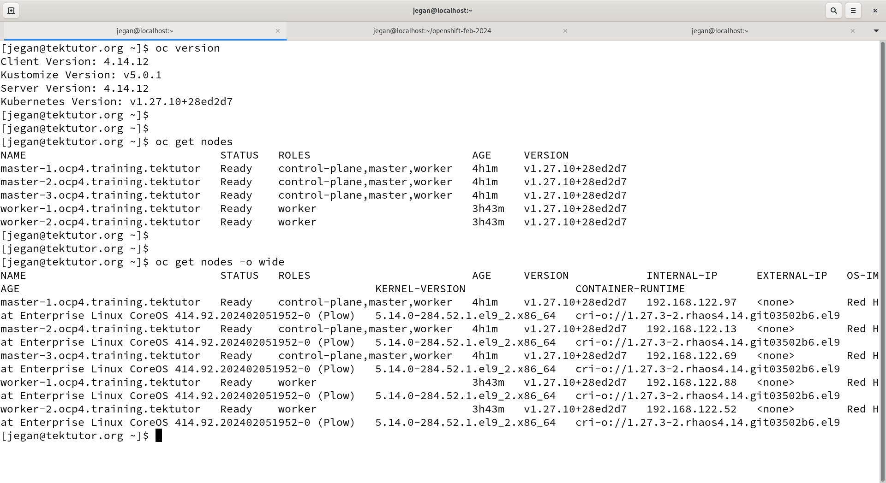
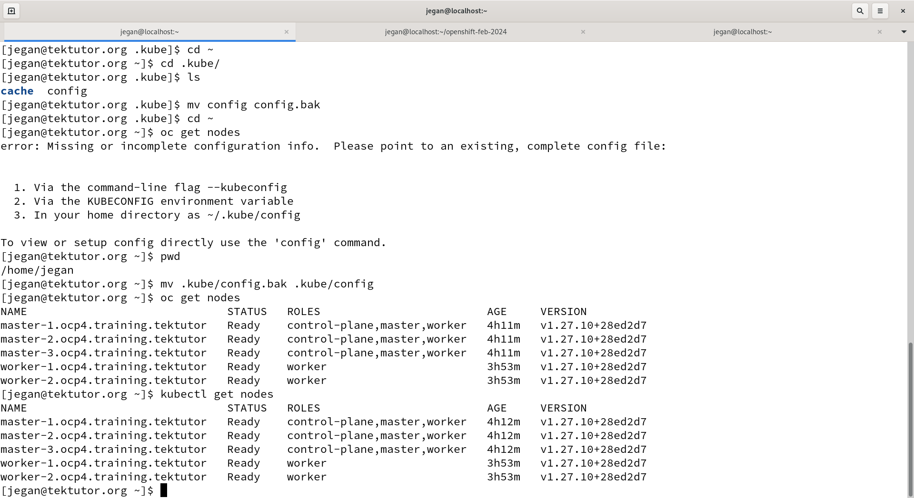

# Day 1
## Virtualization (Hypervisors)
- If your Desktop/Laptop/Servers has a processor that supports Virtualization
- Processor
  - AMD ( Virtualization Feature - AMD-V )
  - Intel ( VT-X )
- Two types
  - Type 1 - Bare Metal Hypervisor - Used in Workstations/Servers (Doesn't require OS to create Virtual Machines )
  - Type2 - Used in Desktops/Laptops/Workstations (requires Host OS)
- Examples
  - VMWare Workstation
  - VMWare vSphere/vCenter
  - Oracle VirtualBox
  - Parallels
  - Microsoft Hyper-V
- This helps in running many Operating System side by side on your laptop/desktop simultaneously
- Many OS can be actively running at the same time on your Laptop/Desktop/Workstation/Server
- This type of virtualization is heavy-weight
  - Because it requires allocated dedicated Hardware resources to each Virtual Machine
  - We need to allocate CPU Core for each Virtual Machine(Guest OS)
  - We need to allocate RAM for each Virtual Machine(Guest OS)
  - We need to allocate Storage/Hardisk for each Virtual Machine(Guest OS)
  - the hypervisor software ensure the hardware resources allocated to one OS is not used by other OS running on the same base machine
  - Each Virtual Machine represents one OS
  
## Docker Overview
- is a Linux containerization technology powered by Linux Kernel
- lightweight application virtualization
- container doesn't represent OS
- containers comes with one single application with all its dependent libraries/software tools
- Linux Kernel supports
  - CGroups ( this helps in apply hardware quota restrictions to every containers )
  - Namespace (this helps isolating one container from other containers )
- LXC
- Container Runtime (runC, CRI-O) vs Container Engine (Docker, Podman)
- each container represents one application
- each container get its own file system
- each container has its own network stack ( 7 OSI Layers )
- it's a software defined network
- each container get its own IP address ( Private IP )

## Container Runtime Overview
- Container Runtime software tools manages containers
- they know
  - how to create a container
  - list a container
  - delete a continer
  - start/stop/restart
  - kill/abort containers
- these are low-level software which are not so user friendly, hence end-users like us normally won't use this directly
- these softwares are used by Container Engines to manage containers
Examples
- runC
- CRI-O

## Container Engine
- high-level software that depends on Container Runtime to manage containers
- they offer user-friendly commands to manage images and containers without need to underdstand low-level kernel stuffs
- Examples
  - Docker ( uses containerd which in turn uses runC container runtime )
  - Podman ( uses CRI-O container runtime ) - Red Hat openshift starting from v4.x support only Podman
  - Containerd ( uses runC container runtime )


## Container Orchestration Platforms
- helps us provide an eco-system to make our application highly-available (HA)
- your application has to be deployed within container orchestratino platform as containerized applications
- supports inbuilt monitoring features to check the health/liveliness of application and can heal/repair when there is a need
- when the user traffic to your application increase, additional container instances can be created to cope up with the heavy user traffic
- when the user traffic to your application comes down, then certain containerized application workloads can be removed
- in case you need to upgrade your live application from one version to other latest version without any downtime
- Examples
  - Docker SWARM ( supports only Docker - Docker Inc's native orchestration platform )
  - Google Kubernetes ( supports multiple types of Containers including Docker )
  - Red Hat OpenShift ( supports only Podman containerized application workloads )

## Google Kubernetes
- The master and worker nodes they can use any of the below Operating System
  - Ubuntu Linux
  - RHEL
  - Oracle Linux
  - Amazon Linux

## Red Hat OpenShift
- container orchestration platforms is setup a cluster of servers
- the servers could be physical machines or virtual machines or public cloud based virtual machines
- there are two types of Nodes(Servers)
  - master node ( Control Plane components runs here )
  - worker node ( user application workloads runs here )
- OpenShift master Nodes
  - supports only RHCOS (Red Hat Enterprise Core OS)
- OpenShift worker Nodes
  - supports two options (Either we could use RHEL or RHCOS OS)
- Control Plane Components ( only runs in master nodes )
  - API Server
  - etcd (key/value datastore/db server)
  - scheduler
  - controller managers ( a collection of many controllers - monitoring )

#### RedHat Enterprise Core OS
- this is an optimized OS for Container Orchestration Platforms like OpenShift
- the configuration to boot this OS comes a special file called ignition which is not part of the RHCOS
- the ignition files that has boot configuration of RHCOS are normally kept in a load balancer running on an external VM/Physical machine
- this OS has puts lot of restrications ( imposes standards & conventions - enforces best practices )
- it only allows to modify files in certain folders
- for instance many folders have only ready only access
- many ports are reserved for OpenShift's private use, applications can't use the reserved ports

#### Openshift/Kubernetes master nodes
- normally it is recommended to run only Control Plane components
- ideally, we should not configure the master nodes to take up user application workloads
- but, if required the master nodes can be configured to take up user application workloads in addition to runninig control plane components

#### What is a Pod?
- Pod is a collection of related containers
- Any application that is deployed inside the Kubernetes/OpenShift they are deployed as Pods
- Every Pod has atleast two containers
  - Secret Infra Container (Pause container) that supports the Network Stack
  - Application container
  - Application container and the Secret Infra Container shares the same Network Stack, hence they share the same IP address, hostname, ports, etc.,
  - IP address is assigned on the Pod level in Kubernetes/Openshift

#### Kubernetes/OpenShift objects/resources
- Pod - Our containerized application runs within the Pod
- ReplicaSet - This tells how many Pods of our application should be running
- Deployment - This tells, what is the name of application deployment, what container image should be used, how many Pod instances should be running
- DaemonSet - If your openshift cluster has 5 nodes, then it would one Pod per node
- Job - any one time task can be achieved via Job
- CronJob - any repeatative tasks 
- StatefulSet - application that requires peristent volume(external storage)
- Service - This is how we can expose an application either within the cluster or outside the cluster

#### Worker Node Components
- kubelet - Container Agent that interacts with CRI-O Container Runtime via the CRI(Container Runtime Interface)
- Kubelet is the one that downloads the required container images and creates the Pod and updates the API Server with the status of each Pod

## Chain of things that happens when we create a deployment
The below command is used to deploy nginx web server in Openshift
```
oc create deploy nginx --image=bitnami/nginx:latest
```

<pre>
1. oc client tool will make a REST call to API Server requesting to create a Deployment db record in etcd database
2. API Server will receive the REST call from oc client, then it creates a Deployment with name nginx in the etcd db server
3. Anytime there is an update in etcd, that results in event trigger, an event something like New Deployment created will be triggered.
4. New Deployment Created event is received by Deployment Controller, which then makes a REST call to API Server to create one Pod using the bitnami/nginx:latest docker image.
5. API Server receives the request from Deployment Controller, then it request the API Server to create a ReplicaSet db entry.
6. API Server creates a ReplicaSet db record, and triggers New ReplicaSet created event.
7. ReplicaSet Controller receives this event, and it will request the API Server to create number of Pods mentioned in the ReplicaSet.
6. This results in a new event triggered something like New Pod created.
7. The scheduler receives the New Pod created event and it responds with recommendation on which node the new Pod could be deployed. Scheduler sends its scheduling recommendation as REST call to API Server.
8. API Server receives the recommendataion from Scheduler, it retrieves the already present Pod record from etcd db server, updates the scheduling details.
9. This results in Pod scheduled event, which is then received by kubelet running on respective nodes.  Kubelet then downloads the required container image and creates the containers associated to certain Pods.
10. Once the containers related to a pod are created by kubelet, it updates the API Server with the status of these containers on heart-beat like fashion periodically.
11. Once the API Server receives the status, the status of those Pods are updated in the etcd db server.

</pre>

  
## Scaling up/down
- is managed by ReplicaSet controller
- when is this useful
  - let's say my microservice is deployed with a single Pod instance
  - now too many users are trying to access my microservice, in this case we can scale up i.e add more Pods of the microservice
  - all microservice pods are active and they serve the end-user at the same time
  
## Rolling update
- is managed by Deployment controller
- this is useful to upgrade your microservice v1.0 to microservice v2.0 without any downtime
- assume you have deployed 3 microservice Pods of version v1.0, now you wish to upgrade to v2.0
- When rolling update happens, the deployment controller will add one v2.0 of microservice, total microservice Pods will be 4 ( 3 Pods of v1.0 and 1 Pod of v2.0)
- Then the replicaset controller will remove one Pod of v1.0, matching the actual Pod count with the desired number of Pods
- The Deployment controller will create 1 more microservice Pod of v2.0, leading to total 4 Pods ( 2 Pods are of v1.0 and 2 Pods are of v2.0)
- The Replicaset controller will remove one Pod of v1.0, effectively a total of 3 Pods ( 2 Pods of v2.0 and 1 Pod of v1.0)

## Info - OpenShift Service
- Let's say we are developing a microservice that needs to fetch some data from a database
- Assume we have create two deployments one for the microserive and the other for the database
- We can't use the IP address of the database in the microservice application, the reason is the Pod is temporary, because the Pod life time is controlled by OpenShift, hence they can be replaced, destroyed at point of time
- To solve this problem, we need something which is permanent for the application to connect to a database or similar service
- Service represents a group of load balanced Pods that belongs to a single deployment
- There are 3 types of Service supported in Kubernetes/OpenShift
  1. ClusterIP (Internal service - accessible only within in Kubernetes/OpenShift cluster)
  2. NodePort ( External service - accessible outside the cluster )
  3. Loadbalancer (External service - meant for cloud - accessible outside the cluster )

## Lab - Listing the RedHat Openshift Nodes
In the below commands, oc and kubectl is the client tool we would be using to interact with Openshift cluster

```
oc version
oc get nodes
oc get nodes -o wide
kubectl get nodes
```

Expected output



## Lab - Create a project before deploying applications

In the below command, replace 'jegan' with your name.
```
oc new-project jegan
```

Expected output
<pre>
[jegan@tektutor.org ~]$ oc new-project jegan
Now using project "jegan" on server "https://api.ocp4.training.tektutor:6443".

You can add applications to this project with the 'new-app' command. For example, try:

    oc new-app rails-postgresql-example

to build a new example application in Ruby. Or use kubectl to deploy a simple Kubernetes application:

    kubectl create deployment hello-node --image=registry.k8s.io/e2e-test-images/agnhost:2.43 -- /agnhost serve-hostname
</pre>

## Lab - Listing projects in Openshift
```
oc get projects
```
Expected output
<pre>
[jegan@tektutor.org ~]$ oc get projects
NAME                                               DISPLAY NAME   STATUS
default                                                           Active
jegan                                                             Active
kube-node-lease                                                   Active
kube-public                                                       Active
kube-system                                                       Active
openshift                                                         Active
openshift-apiserver                                               Active
openshift-apiserver-operator                                      Active
openshift-authentication                                          Active
openshift-authentication-operator                                 Active
openshift-cloud-controller-manager                                Active
openshift-cloud-controller-manager-operator                       Active
openshift-cloud-credential-operator                               Active
openshift-cloud-network-config-controller                         Active
openshift-cluster-csi-drivers                                     Active
openshift-cluster-machine-approver                                Active
openshift-cluster-node-tuning-operator                            Active
openshift-cluster-samples-operator                                Active
openshift-cluster-storage-operator                                Active
openshift-cluster-version                                         Active
openshift-config                                                  Active
openshift-config-managed                                          Active
openshift-config-operator                                         Active
openshift-console                                                 Active
openshift-console-operator                                        Active
openshift-console-user-settings                                   Active
openshift-controller-manager                                      Active
openshift-controller-manager-operator                             Active
openshift-dns                                                     Active
openshift-dns-operator                                            Active
openshift-etcd                                                    Active
openshift-etcd-operator                                           Active
openshift-host-network                                            Active
openshift-image-registry                                          Active
openshift-infra                                                   Active
openshift-ingress                                                 Active
openshift-ingress-canary                                          Active
openshift-ingress-operator                                        Active
openshift-insights                                                Active
openshift-kni-infra                                               Active
openshift-kube-apiserver                                          Active
openshift-kube-apiserver-operator                                 Active
openshift-kube-controller-manager                                 Active
openshift-kube-controller-manager-operator                        Active
openshift-kube-scheduler                                          Active
openshift-kube-scheduler-operator                                 Active
openshift-kube-storage-version-migrator                           Active
openshift-kube-storage-version-migrator-operator                  Active
openshift-machine-api                                             Active
openshift-machine-config-operator                                 Active
openshift-marketplace                                             Active
openshift-monitoring                                              Active
openshift-multus                                                  Active
openshift-network-diagnostics                                     Active
openshift-network-node-identity                                   Active
openshift-network-operator                                        Active
openshift-node                                                    Active
openshift-nutanix-infra                                           Active
openshift-oauth-apiserver                                         Active
openshift-openstack-infra                                         Active
openshift-operator-lifecycle-manager                              Active
openshift-operators                                               Active
openshift-ovirt-infra                                             Active
openshift-route-controller-manager                                Active
openshift-sdn                                                     Active
openshift-service-ca                                              Active
openshift-service-ca-operator                                     Active
openshift-user-workload-monitoring                                Active
openshift-vsphere-infra                                           Active
</pre>  

## Lab - Checking the currently active project
```
oc project
```

Expected output
<pre>
[jegan@tektutor.org ~]$ oc project
Using project "jegan" on server "https://api.ocp4.training.tektutor:6443".  
</pre>

## Lab - Switch a specific project
```
oc project jegan
```

Expected output
<pre>
[jegan@tektutor.org ~]$ oc project
Using project "jegan" on server "https://api.ocp4.training.tektutor:6443".
[jegan@tektutor.org ~]$ oc project jegan
Already on project "jegan" on server "https://api.ocp4.training.tektutor:6443".  
</pre> 

## Lab - Creating your first deployment in imperative style
```
oc create deploy nginx --image=bitnami/nginx:latest
```

Expected output
<pre>
[jegan@tektutor.org ~]$ oc create deploy nginx --image=bitnami/nginx:latest
deployment.apps/nginx created
</pre>

## Lab - Listing the deployments
```
oc get deployments
oc get deployment
oc get deploy
```

Expected output
<pre>
[jegan@tektutor.org ~]$ oc get deployments
NAME    READY   UP-TO-DATE   AVAILABLE   AGE
nginx   0/1     1            0           8s
[jegan@tektutor.org ~]$ oc get deployment
NAME    READY   UP-TO-DATE   AVAILABLE   AGE
nginx   1/1     1            1           11s
[jegan@tektutor.org ~]$ oc get deploy
NAME    READY   UP-TO-DATE   AVAILABLE   AGE
nginx   1/1     1            1           14s    
</pre>

## Lab - Listing replicasets
```
oc get replicasets
oc get replicaset
oc get rs
```

Expected output
<pre>
[jegan@tektutor.org ~]$ oc get replicasets
NAME              DESIRED   CURRENT   READY   AGE
nginx-bb865dc5f   1         1         1       11s
[jegan@tektutor.org ~]$ oc get replicaset
NAME              DESIRED   CURRENT   READY   AGE
nginx-bb865dc5f   1         1         1       15s
[jegan@tektutor.org ~]$ oc get rs
NAME              DESIRED   CURRENT   READY   AGE
nginx-bb865dc5f   1         1         1       17s  
</pre>

## Lab - Listing the Pods
```
oc get pods
oc get pod
oc get po
```

Expected output
<pre>
[jegan@tektutor.org ~]$ oc get pods
NAME                    READY   STATUS    RESTARTS   AGE
nginx-bb865dc5f-78jjm   1/1     Running   0          13m
[jegan@tektutor.org ~]$ oc get pod
NAME                    READY   STATUS    RESTARTS   AGE
nginx-bb865dc5f-78jjm   1/1     Running   0          13m
[jegan@tektutor.org ~]$ oc get po
NAME                    READY   STATUS    RESTARTS   AGE
nginx-bb865dc5f-78jjm   1/1     Running   0          13m  
</pre>

## Lab - Listing deployment, replicaset and pods in one command
```
oc get deploy,rs,po
oc get po,rs,deploy
```

Expected output
<pre>
[jegan@tektutor.org ~]$ oc get deploy,rs,po
NAME                    READY   UP-TO-DATE   AVAILABLE   AGE
deployment.apps/nginx   1/1     1            1           14m

NAME                              DESIRED   CURRENT   READY   AGE
replicaset.apps/nginx-bb865dc5f   1         1         1       14m

NAME                        READY   STATUS    RESTARTS   AGE
pod/nginx-bb865dc5f-78jjm   1/1     Running   0          14m
[jegan@tektutor.org ~]$ oc get po,rs,deploy
NAME                        READY   STATUS    RESTARTS   AGE
pod/nginx-bb865dc5f-78jjm   1/1     Running   0          15m

NAME                              DESIRED   CURRENT   READY   AGE
replicaset.apps/nginx-bb865dc5f   1         1         1       15m

NAME                    READY   UP-TO-DATE   AVAILABLE   AGE
deployment.apps/nginx   1/1     1            1           15m  
</pre>

## Lab - Deleting deployment
```
oc project
oc get deploy
oc delete deploy/nginx
oc get deploy,rs,po
```

Expected output
<pre>
[jegan@tektutor.org ~]$ oc get deploy
NAME    READY   UP-TO-DATE   AVAILABLE   AGE
nginx   1/1     1            1           21m
[jegan@tektutor.org ~]$ oc delete deploy/nginx
deployment.apps "nginx" deleted
[jegan@tektutor.org ~]$ oc get deploy,rs,po
No resources found in jegan namespace.  
</pre>

## Lab - Editing deployment
```
oc get deploy
oc edit deploy/nginx
```

## Lab - Editing replicaset
```
oc get rs
oc edit rs/nginx-68cbdcc668
```

## Lab - Edit Pod
```
oc get po
oc edit pod/nginx-68cbdcc668-qkrwk
```

## Lab - Scaling up/down nginx deployment
```
oc get po
oc scale deploy/nginx --replicas=5
oc get po -w
oc scale deploy/nginx --replicas=3
oc get po -w
```

Expected output
<pre>
[jegan@tektutor.org ~]$ oc get po
NAME                     READY   STATUS    RESTARTS   AGE
nginx-68cbdcc668-42kdl   1/1     Running   0          30m
nginx-68cbdcc668-lbkgz   1/1     Running   0          30m
nginx-68cbdcc668-qkrwk   1/1     Running   0          30m
[jegan@tektutor.org ~]$ oc scale deploy/nginx --replicas=5
deployment.apps/nginx scaled
  
[jegan@tektutor.org ~]$ oc get po -w
NAME                     READY   STATUS    RESTARTS   AGE
nginx-68cbdcc668-42kdl   1/1     Running   0          30m
nginx-68cbdcc668-6fhzw   1/1     Running   0          4s
nginx-68cbdcc668-lbkgz   1/1     Running   0          30m
nginx-68cbdcc668-qkrwk   1/1     Running   0          30m
nginx-68cbdcc668-vmb5p   1/1     Running   0          4s
  
^C[jegan@tektutor.org ~]$ oc scale deploy/nginx --replicas=3
deployment.apps/nginx scaled
  
[jegan@tektutor.org ~]$ oc get po -w
NAME                     READY   STATUS    RESTARTS   AGE
nginx-68cbdcc668-42kdl   1/1     Running   0          30m
nginx-68cbdcc668-lbkgz   1/1     Running   0          30m
nginx-68cbdcc668-qkrwk   1/1     Running   0          30m  
</pre>

## Lab - Finding the IP address of the Pods
```
oc get po -o wide
```

Expected output
<pre>
[jegan@tektutor.org ~]$ oc get po -o wide
NAME                     READY   STATUS    RESTARTS   AGE   IP            NODE                              NOMINATED NODE   READINESS GATES
nginx-68cbdcc668-42kdl   1/1     Running   0          33m   10.131.0.9    worker-2.ocp4.training.tektutor   <none>           <none>
nginx-68cbdcc668-lbkgz   1/1     Running   0          34m   10.128.2.9    worker-1.ocp4.training.tektutor   <none>           <none>
nginx-68cbdcc668-qkrwk   1/1     Running   0          33m   10.128.0.93   master-1.ocp4.training.tektutor   <none>           <none>
</pre>

## Lab - Port forwarding for quickly test the Pod service
In the below command, port 9090 is on the local machine. Any request that is received on localhost 9090 will be forwarded to the Pod at Port 8080.

You could use any port of your choice, the only thing is it should be available on your local machine.
```
oc get po
oc port-forward pod/nginx-68cbdcc668-42kdl 9090:8080
```

Expected output
<pre>
[jegan@tektutor.org ~]$ oc port-forward pod/nginx-68cbdcc668-42kdl 9090:8080
Forwarding from 127.0.0.1:9090 -> 8080
Forwarding from [::1]:9090 -> 8080
Handling connection for 9090  
</pre>

On a different tab on the terminal, you can access the web page
```
curl http://localhost:9090
```

Expected output
```
[jegan@tektutor.org openshift-feb-2024]$ curl http://localhost:9090
<!DOCTYPE html>
<html>
<head>
<title>Welcome to nginx!</title>
<style>
html { color-scheme: light dark; }
body { width: 35em; margin: 0 auto;
font-family: Tahoma, Verdana, Arial, sans-serif; }
</style>
</head>
<body>
<h1>Welcome to nginx!</h1>
<p>If you see this page, the nginx web server is successfully installed and
working. Further configuration is required.</p>

<p>For online documentation and support please refer to
<a href="http://nginx.org/">nginx.org</a>.<br/>
Commercial support is available at
<a href="http://nginx.com/">nginx.com</a>.</p>

<p><em>Thank you for using nginx.</em></p>
</body>
</html>
```

## Lab - Getting inside a Pod shell
```
oc get po
oc exec -it pod/nginx-68cbdcc668-qkrwk bash
exit
```

Expected output
'''
[jegan@tektutor.org openshift-feb-2024]$ oc get po
NAME                     READY   STATUS    RESTARTS   AGE
nginx-68cbdcc668-42kdl   1/1     Running   0          47m
nginx-68cbdcc668-lbkgz   1/1     Running   0          47m
nginx-68cbdcc668-qkrwk   1/1     Running   0          47m

[jegan@tektutor.org openshift-feb-2024]$ oc exec -it pod/nginx-68cbdcc668-qkrwk bash
kubectl exec [POD] [COMMAND] is DEPRECATED and will be removed in a future version. Use kubectl exec [POD] -- [COMMAND] instead.
  
1000690000@nginx-68cbdcc668-qkrwk:/app$ ls
50x.html  index.html
  
1000690000@nginx-68cbdcc668-qkrwk:/app$ cat index.html 
<!DOCTYPE html>
<html>
<head>
<title>Welcome to nginx!</title>
<style>
html { color-scheme: light dark; }
body { width: 35em; margin: 0 auto;
font-family: Tahoma, Verdana, Arial, sans-serif; }
</style>
</head>
<body>
<h1>Welcome to nginx!</h1>
<p>If you see this page, the nginx web server is successfully installed and
working. Further configuration is required.</p>

<p>For online documentation and support please refer to
<a href="http://nginx.org/">nginx.org</a>.<br/>
Commercial support is available at
<a href="http://nginx.com/">nginx.com</a>.</p>

<p><em>Thank you for using nginx.</em></p>
</body>
</html>
1000690000@nginx-68cbdcc668-qkrwk:/app$ exit
exit
[jegan@tektutor.org openshift-feb-2024]$   
'''

## Lab - Getting inside a Pod shell (Recommended approach - Best practice)
```
oc rsh deploy/nginx
oc rsh pod/nginx-68cbdcc668-qkrwk
oc exec -it pod/nginx-68cbdcc668-qkrwk -- bash
```

Expected output
<pre>
[jegan@tektutor.org openshift-feb-2024]$ oc get deploy
NAME    READY   UP-TO-DATE   AVAILABLE   AGE
nginx   3/3     3            3           73m
[jegan@tektutor.org openshift-feb-2024]$ oc rsh deploy/nginx
$ ls
50x.html  index.html
$ exit  

[jegan@tektutor.org openshift-feb-2024]$ oc get po
NAME                     READY   STATUS    RESTARTS   AGE
nginx-68cbdcc668-42kdl   1/1     Running   0          53m
nginx-68cbdcc668-lbkgz   1/1     Running   0          53m
nginx-68cbdcc668-qkrwk   1/1     Running   0          52m
  
[jegan@tektutor.org openshift-feb-2024]$ oc rsh pod/nginx-68cbdcc668-qkrwk 
$ ls
50x.html  index.html
$ exit
[jegan@tektutor.org openshift-feb-2024]$   

[jegan@tektutor.org openshift-feb-2024]$ oc exec -it pod/nginx-68cbdcc668-qkrwk -- bash
1000690000@nginx-68cbdcc668-qkrwk:/app$ 
</pre>

## Lab - Creating an internal service of type ClusterIP
```
oc project
oc create deployment nginx --image=bitnami/nginx:latest --replicas=3
oc get deploy,rs,po
oc get po

oc expose deploy/nginx --type=ClusterIP --port=8080
oc get svc
oc describe svc/nginx
```

Expected output
<pre>
[jegan@tektutor.org openshift-feb-2024]$ oc create deployment nginx --image=bitnami/nginx:latest --replicas=3
deployment.apps/nginx created
  
[jegan@tektutor.org openshift-feb-2024]$ oc get deploy,rs,po
NAME                    READY   UP-TO-DATE   AVAILABLE   AGE
deployment.apps/nginx   0/3     3            0           6s

NAME                              DESIRED   CURRENT   READY   AGE
replicaset.apps/nginx-bb865dc5f   3         3         0       6s

NAME                        READY   STATUS              RESTARTS   AGE
pod/nginx-bb865dc5f-88x8t   0/1     ContainerCreating   0          6s
pod/nginx-bb865dc5f-j2q84   0/1     ContainerCreating   0          6s
pod/nginx-bb865dc5f-n25vk   0/1     ContainerCreating   0          6s
  
[jegan@tektutor.org openshift-feb-2024]$ oc get po
NAME                    READY   STATUS    RESTARTS   AGE
nginx-bb865dc5f-88x8t   1/1     Running   0          22s
nginx-bb865dc5f-j2q84   1/1     Running   0          22s
nginx-bb865dc5f-n25vk   1/1     Running   0          22s
  
[jegan@tektutor.org openshift-feb-2024]$ oc expose deploy/nginx --type=ClusterIP --port=8080
service/nginx exposed
  
[jegan@tektutor.org openshift-feb-2024]$ oc get svc
NAME    TYPE        CLUSTER-IP      EXTERNAL-IP   PORT(S)    AGE
nginx   ClusterIP   172.30.148.77   <none>        8080/TCP   4s 

[jegan@tektutor.org openshift-feb-2024]$ oc describe svc/nginx
Name:              nginx
Namespace:         jegan
Labels:            app=nginx
Annotations:       <none>
Selector:          app=nginx
Type:              ClusterIP
IP Family Policy:  SingleStack
IP Families:       IPv4
IP:                172.30.148.77
IPs:               172.30.148.77
Port:              <unset>  8080/TCP
TargetPort:        8080/TCP
Endpoints:         10.128.0.195:8080,10.128.2.21:8080,10.131.0.15:8080
Session Affinity:  None
Events:            <none>  
</pre>

## Lab - Checking Pod /etc/resolv.conf file for dns configuration
Let's find the dns pod running on each node (daemonset). Note down the service IP address of dns-default
```
oc get po -o wide -n openshift-dns
oc get svc/dns-default -n openshift-dns
```
Expected output
<pre>
[jegan@tektutor.org ~]$ oc get svc -n openshift-dns
NAME          TYPE        CLUSTER-IP    EXTERNAL-IP   PORT(S)                  AGE
dns-default   ClusterIP   172.30.0.10   <none>        53/UDP,53/TCP,9154/TCP   27h  
</pre>

Let's open shell inside nginx pod, the etc/resolv.conf will point to the dns-default service IP address
```
oc get po
oc rsh deploy/nginx
cat /etc/resolv.conf
```
Expected output
<pre>
$ cat /etc/resolv.conf
search jegan.svc.cluster.local svc.cluster.local cluster.local ocp4.training.tektutor
nameserver 172.30.0.10
options ndots:5
$ exit  
</pre>

This is how the service discovery i.e given a service name it gets resolved to its IP address by the DNS pod.

## Lab - Testing the internal cluster ip service

Let's create a test pod to access the nginx service
```
oc create deployment test --image=tektutor/spring-ms:1.0
oc describe svc/nginx
oc rsh deploy/test
curl http://nginx:8080
```
In the above command, the nginx is the name of the clusterip internal service we created for nginx deployment.  The port 8080 is the service port.

Since this nginx service is an internal service, it can only be accessed from within the openshift cluster.

## Lab - Creating a NodePort external service for nginx deployment
```
oc get svc
oc get deploy
oc delete svc/nginx
oc get svc

oc expose deploy/nginx --type=NodePort --port=8080
oc get svc
oc describe svc/nginx
```

Expected output
<pre>
[jegan@tektutor.org ~]$ oc get svc
NAME    TYPE        CLUSTER-IP      EXTERNAL-IP   PORT(S)    AGE
nginx   ClusterIP   172.30.148.77   <none>        8080/TCP   175m
  
[jegan@tektutor.org ~]$ oc get deploy
NAME    READY   UP-TO-DATE   AVAILABLE   AGE
nginx   5/5     5            5           177m
test    1/1     1            1           152m
  
[jegan@tektutor.org ~]$ oc delete svc/nginx
service "nginx" deleted
[jegan@tektutor.org ~]$ oc get svc
No resources found in jegan namespace.  

[jegan@tektutor.org ~]$ oc expose deploy/nginx --type=NodePort --port=8080
service/nginx exposed
  
[jegan@tektutor.org ~]$ oc get svc
NAME    TYPE       CLUSTER-IP      EXTERNAL-IP   PORT(S)          AGE
nginx   NodePort   172.30.65.236   <none>        8080:31867/TCP   2s
  
[jegan@tektutor.org ~]$ oc describe svc/nginx
Name:                     nginx
Namespace:                jegan
Labels:                   app=nginx
Annotations:              <none>
Selector:                 app=nginx
Type:                     NodePort
IP Family Policy:         SingleStack
IP Families:              IPv4
IP:                       172.30.65.236
IPs:                      172.30.65.236
Port:                     <unset>  8080/TCP
TargetPort:               8080/TCP
NodePort:                 <unset>  31867/TCP
Endpoints:                10.128.0.195:8080,10.128.2.21:8080,10.129.0.147:8080 + 2 more...
Session Affinity:         None
External Traffic Policy:  Cluster
Events:                   <none>  
</pre>

## Lab - Accessing the NodePort external service
Openshift assigns a nodeport in the range 30000 to 32767.  In this case, 31867 is the node port that is opened on all nodes. Hence, we should be able to access the nodeport service via any node irrespective where the respective pods are running.

```
oc get node -o wide

curl master-1.ocp4.training.tektutor:31867
curl 192.168.122.97:31867
curl 192.168.122.13:31867
```

Expected output
```
[jegan@tektutor.org ~]$ oc get node -o wide
NAME                              STATUS   ROLES                         AGE   VERSION            INTERNAL-IP      EXTERNAL-IP   OS-IMAGE                                                       KERNEL-VERSION                 CONTAINER-RUNTIME
master-1.ocp4.training.tektutor   Ready    control-plane,master,worker   28h   v1.27.10+28ed2d7   192.168.122.97   <none>        Red Hat Enterprise Linux CoreOS 414.92.202402051952-0 (Plow)   5.14.0-284.52.1.el9_2.x86_64   cri-o://1.27.3-2.rhaos4.14.git03502b6.el9
master-2.ocp4.training.tektutor   Ready    control-plane,master,worker   28h   v1.27.10+28ed2d7   192.168.122.13   <none>        Red Hat Enterprise Linux CoreOS 414.92.202402051952-0 (Plow)   5.14.0-284.52.1.el9_2.x86_64   cri-o://1.27.3-2.rhaos4.14.git03502b6.el9
master-3.ocp4.training.tektutor   Ready    control-plane,master,worker   28h   v1.27.10+28ed2d7   192.168.122.69   <none>        Red Hat Enterprise Linux CoreOS 414.92.202402051952-0 (Plow)   5.14.0-284.52.1.el9_2.x86_64   cri-o://1.27.3-2.rhaos4.14.git03502b6.el9
worker-1.ocp4.training.tektutor   Ready    worker                        28h   v1.27.10+28ed2d7   192.168.122.88   <none>        Red Hat Enterprise Linux CoreOS 414.92.202402051952-0 (Plow)   5.14.0-284.52.1.el9_2.x86_64   cri-o://1.27.3-2.rhaos4.14.git03502b6.el9
worker-2.ocp4.training.tektutor   Ready    worker                        28h   v1.27.10+28ed2d7   192.168.122.52   <none>        Red Hat Enterprise Linux CoreOS 414.92.202402051952-0 (Plow)   5.14.0-284.52.1.el9_2.x86_64   cri-o://1.27.3-2.rhaos4.14.git03502b6.el9

[jegan@tektutor.org ~]$ curl master-1.ocp4.training.tektutor:31867
<!DOCTYPE html>
<html>
<head>
<title>Welcome to nginx!</title>
<style>
html { color-scheme: light dark; }
body { width: 35em; margin: 0 auto;
font-family: Tahoma, Verdana, Arial, sans-serif; }
</style>
</head>
<body>
<h1>Welcome to nginx!</h1>
<p>If you see this page, the nginx web server is successfully installed and
working. Further configuration is required.</p>

<p>For online documentation and support please refer to
<a href="http://nginx.org/">nginx.org</a>.<br/>
Commercial support is available at
<a href="http://nginx.com/">nginx.com</a>.</p>

<p><em>Thank you for using nginx.</em></p>
</body>
</html>
```
