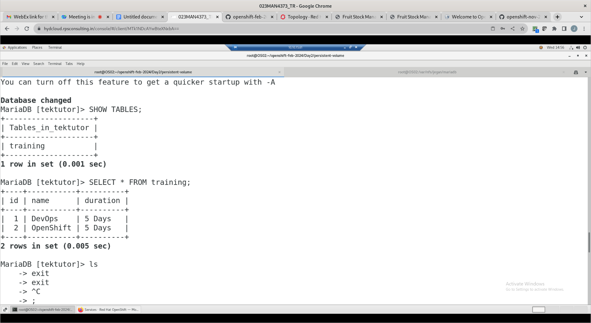

# Day 2

## My Blog about OpenShift Ingress
https://medium.com/@jegan_50867/redhat-openshift-ingress-e91f27a35773

## Reference
https://kubernetes.io/docs/concepts/services-networking/ingress/

## Adavantages of ClusterIP 
- it is free as this type of loadbalancing service is totally implemented by Kubernetes/Openshift, hence no extra charges from AWS/Azure or any public cloud

### Advantages of using NodePort service
- it is free as it is implemented by Kubernetes/Openshift
- it won't attract any extra charges from public cloud

## Disadvantages of using NodePort service
- for each NodePort service Openshift will open one port on every node in the range 30000-32627
- the more number of NodePort services we create it is going to open too many ports, this is security issue
- it is not so user-friendly
- Example
  - In order to access node port service
    http://node-ip:node-port
  - We need to know the node ip and node-port, the node ip is going to be different on different openshift cluster

## Disadvantages of using LoadBalancer service
- it is expensive
- for each loadbalancer service we create in aws managed openshift (ROSA) or Azure managed openshift it will spin an external load balancer, this will attract additional charges from AWS/Azure

## What is Kubernetes/Openshift Ingress?
- it is not a service
- it is forwarding rule
- Ingress configures some set of rules
- In ClusterIP, NodePort or LoadBalancer service load-balances the pods of a specific deployment
- In case of Ingress, it is a set of rule that an Ingress controller picks and applies on Load Balancer
- For an Ingress to work in Kubernetes/Openshift, we need the below
  - An IngressController should be running ( Nginx Ingress Controller or HAProxy Ingress Controller )
  - Ingress Rule
  - Load Balancer ( Nginx, HAProxy, etc., )
  
- Nginx Ingress Controller knows how to configure a Nginx Load Balancer
- HAProxy Ingress Controller knows how to configure a HAProxy Load Balancer
## What is the recommended technique used to expose an external service in Openshift?
Openshift route is alternate feature of odePort service.  Route makes your application accessible to the outside world without the complications of NodePort service with an user-friendly url.

```
oc new-project jegan
oc create deploy nginx --image=bitnami/nginx:latest --replicas=3
oc expose deploy/nginx --port=8080
oc get svc
oc expose svc/nginx
oc get route
curl nginx-jegan.apps.ocp4.training.tektutor
```

Expected output
```
[jegan@tektutor.org openshift-feb-2024]$ oc new-project jegan
Already on project "jegan" on server "https://api.ocp4.training.tektutor:6443".

You can add applications to this project with the 'new-app' command. For example, try:

    oc new-app rails-postgresql-example

to build a new example application in Ruby. Or use kubectl to deploy a simple Kubernetes application:

    kubectl create deployment hello-node --image=registry.k8s.io/e2e-test-images/agnhost:2.43 -- /agnhost serve-hostname

[jegan@tektutor.org openshift-feb-2024]$ oc create deploy nginx --image=bitnami/nginx:latest --replicas=3
deployment.apps/nginx created

[jegan@tektutor.org openshift-feb-2024]$ oc expose deploy/nginx --port=8080
service/nginx exposed

[jegan@tektutor.org openshift-feb-2024]$ oc get svc
NAME    TYPE        CLUSTER-IP       EXTERNAL-IP   PORT(S)    AGE
nginx   ClusterIP   172.30.195.217   <none>        8080/TCP   5s

[jegan@tektutor.org openshift-feb-2024]$ oc expose svc/nginx
route.route.openshift.io/nginx exposed

[jegan@tektutor.org openshift-feb-2024]$ oc get route
NAME    HOST/PORT                                 PATH   SERVICES   PORT   TERMINATION   WILDCARD
nginx   nginx-jegan.apps.ocp4.training.tektutor          nginx      8080                 None

[jegan@tektutor.org openshift-feb-2024]$ curl nginx-jegan.apps.ocp4.training.tektutor
<!DOCTYPE html>
<html>
<head>
<title>Welcome to nginx!</title>
<style>
html { color-scheme: light dark; }
body { width: 35em; margin: 0 auto;
font-family: Tahoma, Verdana, Arial, sans-serif; }
</style>
</head>
<body>
<h1>Welcome to nginx!</h1>
<p>If you see this page, the nginx web server is successfully installed and
working. Further configuration is required.</p>

<p>For online documentation and support please refer to
<a href="http://nginx.org/">nginx.org</a>.<br/>
Commercial support is available at
<a href="http://nginx.com/">nginx.com</a>.</p>

<p><em>Thank you for using nginx.</em></p>
</body>
</html>
```

## Lab - Creating an ingress rule
You need to find the base domain of your Openshift cluster
```
oc describe ingresscontroller/default -n openshift-ingress-operator | grep Domain:
```
Expected output
<pre>
[jegan@tektutor.org openshift-feb-2024]$ oc describe ingresscontroller/default -n openshift-ingress-operator | grep Domain:
  Domain:                  apps.ocp4.training.tektutor
</pre>

As per the output you got for the above command, you need to update the ingress.yml under Day2/ingress folder.

```
oc create deploy nginx --image=bitnami/nginx:latest --replicas=3
oc expose deploy/nginx --port=8080

oc create deploy hello --image=tektutor/spring-ms:1.0 --replicas=3
oc expose deploy/hello --port=8080

oc get svc

cd ~/openshift-feb-2024
git pull
cd Day2/ingress
oc apply -f ingress.yml

oc get ingress
oc describe ingress/tektutor
```

Expected output
```
[jegan@tektutor.org openshift-feb-2024]$ oc get all
Warning: apps.openshift.io/v1 DeploymentConfig is deprecated in v4.14+, unavailable in v4.10000+
No resources found in jegan namespace.
[jegan@tektutor.org openshift-feb-2024]$ oc create deployment nginx --image=bitnami/nginx --replicas=3
deployment.apps/nginx created
[jegan@tektutor.org openshift-feb-2024]$ oc create deployment hello --image=tektutor/spring-ms:1.0 --replicas=3
deployment.apps/hello created
[jegan@tektutor.org openshift-feb-2024]$ oc expose deploy/nginx --port=8080
service/nginx exposed
[jegan@tektutor.org openshift-feb-2024]$ oc expose deploy/hello--port=8080
Error from server (NotFound): deployments.apps "hello--port=8080" not found
[jegan@tektutor.org openshift-feb-2024]$ oc expose deploy/hello --port=8080
service/hello exposed
[jegan@tektutor.org openshift-feb-2024]$ oc get svc
NAME    TYPE        CLUSTER-IP       EXTERNAL-IP   PORT(S)    AGE
hello   ClusterIP   172.30.14.211    <none>        8080/TCP   3s
nginx   ClusterIP   172.30.139.232   <none>        8080/TCP   12s
[jegan@tektutor.org openshift-feb-2024]$ cd Day2
[jegan@tektutor.org Day2]$ ls
ingress  README.md
[jegan@tektutor.org Day2]$ cd ingress/
[jegan@tektutor.org ingress]$ ls
ingress.yml
[jegan@tektutor.org ingress]$ oc apply -f ingress.yml 
ingress.networking.k8s.io/tektutor created
[jegan@tektutor.org ingress]$ oc get ingress
NAME       CLASS    HOSTS                                  ADDRESS                                      PORTS   AGE
tektutor   <none>   tektutor.apps.ocp4.training.tektutor   router-default.apps.ocp4.training.tektutor   80      4s
[jegan@tektutor.org ingress]$ curl tektutor.apps.ocp4.training.tektutor/nginx
<!DOCTYPE html>
<html>
<head>
<title>Welcome to nginx!</title>
<style>
html { color-scheme: light dark; }
body { width: 35em; margin: 0 auto;
font-family: Tahoma, Verdana, Arial, sans-serif; }
</style>
</head>
<body>
<h1>Welcome to nginx!</h1>
<p>If you see this page, the nginx web server is successfully installed and
working. Further configuration is required.</p>

<p>For online documentation and support please refer to
<a href="http://nginx.org/">nginx.org</a>.<br/>
Commercial support is available at
<a href="http://nginx.com/">nginx.com</a>.</p>

<p><em>Thank you for using nginx.</em></p>
</body>
</html>
[jegan@tektutor.org ingress]$ curl tektutor.apps.ocp4.training.tektutor/hello
Greetings from Spring Boot!
```

## Lab - Creating a new type of Custom Resource by defining a Custom Resource Definition (CRD)
```
cd ~/
cd openshift-feb-2024
git pull
cd Day2/crd
oc get trainings
oc get training
oc get train
oc apply -f training-crd.yml
oc get crds
oc get trainings
oc get training
oc get train
```

Expected output
<pre>
[jegan@tektutor.org crd]$ ls
devops-training.yml  openshift-training.yml  training-crd.yml
[jegan@tektutor.org crd]$ oc apply -f training-crd.yml 
customresourcedefinition.apiextensions.k8s.io/trainings.tektutor.org created
[jegan@tektutor.org crd]$ oc apply -f devops-training.yml 
training.tektutor.org/devops-training created
[jegan@tektutor.org crd]$ oc apply -f openshift-training.yml 
training.tektutor.org/openshift-training created
[jegan@tektutor.org crd]$ oc get trainings
NAME                 AGE
devops-training      12s
openshift-training   5s
[jegan@tektutor.org crd]$ oc get training
NAME                 AGE
devops-training      16s
openshift-training   9s
[jegan@tektutor.org crd]$ oc get train
NAME                 AGE
devops-training      19s
openshift-training   12s  
</pre>

## Lab - Deploying a application that uses external storage ( Persistent Volume and Persistent Volume Claims )
```
cd ~/openshift-feb-2024
git pull
cd Day2/persistent-volume

oc apply -f mariadb-pv.yml
oc apply -f mariadb-pvc.yml
oc apply -f mariadb-deploy.yml

oc get pv,pvc,deploy
oc get po
```

Expected output




## Lab - Creating nginx deployment in declarative style
```
oc create deployment nginx --image=bitnami/nginx:latest --replicas=3 --dry-run=client -o yaml
oc create deployment nginx --image=bitnami/nginx:latest --replicas=3 --dry-run=client -o json

oc create deployment nginx --image=bitnami/nginx:latest --replicas=3 --dry-run=client -o yaml > nginx-deploy.yml

oc apply -f nginx-deploy.yml
```

Expected output
<pre>
[jegan@tektutor.org declartive-manifests]$ oc create deployment nginx --image=bitnami/nginx:latest --replicas=3 --dry-run=client -o yaml
apiVersion: apps/v1
kind: Deployment
metadata:
  creationTimestamp: null
  labels:
    app: nginx
  name: nginx
spec:
  replicas: 3
  selector:
    matchLabels:
      app: nginx
  strategy: {}
  template:
    metadata:
      creationTimestamp: null
      labels:
        app: nginx
    spec:
      containers:
      - image: bitnami/nginx:latest
        name: nginx
        resources: {}
status: {}

[jegan@tektutor.org declartive-manifests]$ ls
nginx-deploy.yml
  
[jegan@tektutor.org declartive-manifests]$ oc apply -f nginx-deploy.yml 
deployment.apps/nginx created
  
[jegan@tektutor.org declartive-manifests]$ oc get deploy,rs,po
NAME                    READY   UP-TO-DATE   AVAILABLE   AGE
deployment.apps/nginx   0/3     3            0           7s

NAME                              DESIRED   CURRENT   READY   AGE
replicaset.apps/nginx-bb865dc5f   3         3         0       7s

NAME                        READY   STATUS              RESTARTS   AGE
pod/nginx-bb865dc5f-4v2bl   0/1     ContainerCreating   0          7s
pod/nginx-bb865dc5f-cn2fd   0/1     ContainerCreating   0          7s
pod/nginx-bb865dc5f-jxmc5   0/1     ContainerCreating   0          7s
  
[jegan@tektutor.org declartive-manifests]$ oc get po
NAME                    READY   STATUS              RESTARTS   AGE
nginx-bb865dc5f-4v2bl   1/1     Running             0          15s
nginx-bb865dc5f-cn2fd   0/1     ContainerCreating   0          15s
nginx-bb865dc5f-jxmc5   0/1     ContainerCreating   0          15s
  
[jegan@tektutor.org declartive-manifests]$ oc get po
NAME                    READY   STATUS    RESTARTS   AGE
nginx-bb865dc5f-4v2bl   1/1     Running   0          18s
nginx-bb865dc5f-cn2fd   1/1     Running   0          18s
nginx-bb865dc5f-jxmc5   1/1     Running   0          18s
</pre>
