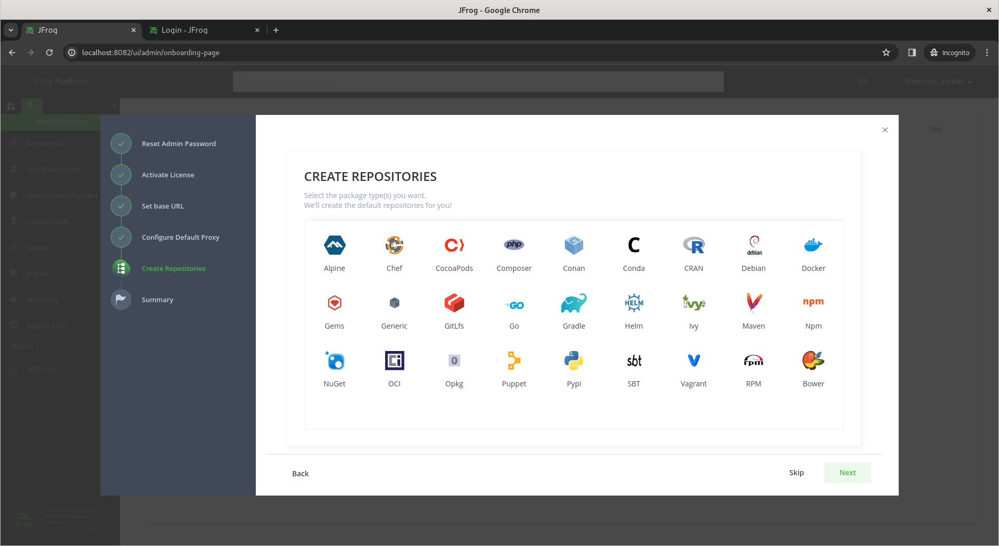

# Day5

## Post test link(Kindly take this test from RPS Lab machine)
https://app.mymapit.in/code4/tiny/v6VtVv

## Feedback link (kindly fill this)
https://survey.zohopublic.com/zs/QZCOHJ

## Lab - BuildConfig
```
oc project
oc new-app https://github.com/tektutor/openshift-feb-2024.git --context-dir=Day5/BuildConfig --strategy=source
```
Expected output
<pre>
[jegan@tektutor.org openshift-feb-2024]$ oc new-app https://github.com/tektutor/openshift-feb-2024.git --context-dir=Day5/BuildConfig --strategy=source
error: No language matched the source repository
[jegan@tektutor.org openshift-feb-2024]$ oc new-app registry.access.redhat.com/ubi8/openjdk-11~https://github.com/tektutor/openshift-feb-2024.git --context-dir=Day5/BuildConfig --strategy=source
--> Found container image 17d970f (5 weeks old) from registry.access.redhat.com for "registry.access.redhat.com/ubi8/openjdk-11"

    Java Applications 
    ----------------- 
    Platform for building and running plain Java applications (fat-jar and flat classpath)

    Tags: builder, java

    * An image stream tag will be created as "openjdk-11:latest" that will track the source image
    * A source build using source code from https://github.com/tektutor/openshift-feb-2024.git will be created
      * The resulting image will be pushed to image stream tag "openshift-feb-2024:latest"
      * Every time "openjdk-11:latest" changes a new build will be triggered

--> Creating resources ...
    imagestream.image.openshift.io "openjdk-11" created
    imagestream.image.openshift.io "openshift-feb-2024" created
    buildconfig.build.openshift.io "openshift-feb-2024" created
    deployment.apps "openshift-feb-2024" created
    service "openshift-feb-2024" created
--> Success
    Build scheduled, use 'oc logs -f buildconfig/openshift-feb-2024' to track its progress.
    Application is not exposed. You can expose services to the outside world by executing one or more of the commands below:
     'oc expose service/openshift-feb-2024' 
    Run 'oc status' to view your app.
[jegan@tektutor.org openshift-feb-2024]$ oc get buildconfigs
NAME                 TYPE     FROM   LATEST
openshift-feb-2024   Source   Git    1
[jegan@tektutor.org openshift-feb-2024]$ oc get buildconfig
NAME                 TYPE     FROM   LATEST
openshift-feb-2024   Source   Git    1
[jegan@tektutor.org openshift-feb-2024]$ oc get bc
NAME                 TYPE     FROM   LATEST
openshift-feb-2024   Source   Git    1
[jegan@tektutor.org openshift-feb-2024]$ oc logs -f bc/openshift-feb-2024
Cloning "https://github.com/tektutor/openshift-feb-2024.git" ...
	Commit:	81a7be62fc2f4fbfdb8575e61294d0af1c04f6bd (Merge branch 'main' of https://github.com/tektutor/openshift-feb-2024)
	Author:	Jeganathan Swaminathan <mail2jegan@gmail.com>
	Date:	Fri Feb 23 12:50:08 2024 +0530
time="2024-02-23T07:24:27Z" level=info msg="Not using native diff for overlay, this may cause degraded performance for building images: kernel has CONFIG_OVERLAY_FS_REDIRECT_DIR enabled"
I0223 07:24:27.636172       1 defaults.go:112] Defaulting to storage driver "overlay" with options [mountopt=metacopy=on].
Caching blobs under "/var/cache/blobs".
Trying to pull registry.access.redhat.com/ubi8/openjdk-11@sha256:b85cbdbc289752c91ac7f468cffef916fe9ab01865f3e32cfcc44ccdd633b168...
Getting image source signatures
Copying blob sha256:00002eebe0f599331474f07547167ad83154a7a902f19a133af9a6f5e08a1dfa
Copying blob sha256:dc35b837139a95d1b9f7f7b0435a024a74ab972416bdc248f3f608c9f917a753
Copying config sha256:17d970f7d5f789087e305ec68b8146195107db18aca710ae8c7de6ac91051504
Writing manifest to image destination
Generating dockerfile with builder image registry.access.redhat.com/ubi8/openjdk-11@sha256:b85cbdbc289752c91ac7f468cffef916fe9ab01865f3e32cfcc44ccdd633b168
Adding transient rw bind mount for /run/secrets/rhsm
STEP 1/9: FROM registry.access.redhat.com/ubi8/openjdk-11@sha256:b85cbdbc289752c91ac7f468cffef916fe9ab01865f3e32cfcc44ccdd633b168
STEP 2/9: LABEL "io.openshift.build.commit.date"="Fri Feb 23 12:50:08 2024 +0530"       "io.openshift.build.source-location"="https://github.com/tektutor/openshift-feb-2024.git"       "io.openshift.build.source-context-dir"="Day5/BuildConfig"       "io.openshift.s2i.destination"="/tmp"       "io.openshift.build.image"="registry.access.redhat.com/ubi8/openjdk-11@sha256:b85cbdbc289752c91ac7f468cffef916fe9ab01865f3e32cfcc44ccdd633b168"       "io.openshift.build.commit.author"="Jeganathan Swaminathan <mail2jegan@gmail.com>"       "io.openshift.build.commit.id"="81a7be62fc2f4fbfdb8575e61294d0af1c04f6bd"       "io.openshift.build.commit.ref"="main"       "io.openshift.build.commit.message"="Merge branch 'main' of https://github.com/tektutor/openshift-feb-2024"
STEP 3/9: ENV OPENSHIFT_BUILD_NAME="openshift-feb-2024-1"     OPENSHIFT_BUILD_NAMESPACE="jegan-devops"     OPENSHIFT_BUILD_SOURCE="https://github.com/tektutor/openshift-feb-2024.git"     OPENSHIFT_BUILD_COMMIT="81a7be62fc2f4fbfdb8575e61294d0af1c04f6bd"
STEP 4/9: USER root
STEP 5/9: COPY upload/src /tmp/src
STEP 6/9: RUN chown -R 185:0 /tmp/src
STEP 7/9: USER 185
STEP 8/9: RUN /usr/local/s2i/assemble
INFO S2I source build with plain binaries detected
INFO Copying binaries from /tmp/src to /deployments ...
buildconfig.yml
INFO Cleaning up source directory (/tmp/src)
STEP 9/9: CMD /usr/local/s2i/run
COMMIT temp.builder.openshift.io/jegan-devops/openshift-feb-2024-1:af7ca7ad
Getting image source signatures
Copying blob sha256:1053d00b8e292c8a36bef630a0f4977b29da4e2fd60ac9425e0fcd1f7c1108d5
Copying blob sha256:69d590f110c1a3ded20b01162470dd317250ee684ec42378e93fa93a569edaa9
Copying blob sha256:a68ae82be6304e734636de25540f03cb356e964301e80f0df4d4d7dab0a95ee1
Copying config sha256:4dcf630618c7b768b373832c3158c78d5a5361ea7e85397e54306ef5707e073a
Writing manifest to image destination
--> 4dcf630618c7
Successfully tagged temp.builder.openshift.io/jegan-devops/openshift-feb-2024-1:af7ca7ad
4dcf630618c7b768b373832c3158c78d5a5361ea7e85397e54306ef5707e073a

Pushing image image-registry.openshift-image-registry.svc:5000/jegan-devops/openshift-feb-2024:latest ...
Getting image source signatures
Copying blob sha256:a68ae82be6304e734636de25540f03cb356e964301e80f0df4d4d7dab0a95ee1
Copying blob sha256:dc35b837139a95d1b9f7f7b0435a024a74ab972416bdc248f3f608c9f917a753
Copying blob sha256:00002eebe0f599331474f07547167ad83154a7a902f19a133af9a6f5e08a1dfa
Copying config sha256:4dcf630618c7b768b373832c3158c78d5a5361ea7e85397e54306ef5707e073a
Writing manifest to image destination
Successfully pushed image-registry.openshift-image-registry.svc:5000/jegan-devops/openshift-feb-2024@sha256:41d4e9d37ab0d8ed50a5e1b1fac9494c0a30a6df85bddb65056a8e87740f7e96
Push successful
</pre>


## Info - Installing JFrog Artifactory Pro in RHEL/CentOS

#### Pre-requisites
- JFrog expects an official email-id to request for a trail license, hence *** I suggest not to try this ***
- You need to be an Administrator on the Linux Server
- You need to have a trial license of JFrog Artifactory Pro

```
sudo -i

pwd

wget -O jfrog-rpm-installer.tar.gz "https://releases.jfrog.io/artifactory/jfrog-prox/org/artifactory/pro/rpm/jfrog-platform-trial-prox/[RELEASE]/jfrog-platform-trial-prox-[RELEASE]-rpm.tar.gz"
```

Expected output
<pre>
[root@tektutor.org ~]# wget -O jfrog-rpm-installer.tar.gz "https://releases.jfrog.io/artifactory/jfrog-prox/org/artifactory/pro/rpm/jfrog-platform-trial-prox/[RELEASE]/jfrog-platform-trial-prox-[RELEASE]-rpm.tar.gz"
Warning: wildcards not supported in HTTP.
--2024-02-23 08:10:55--  https://releases.jfrog.io/artifactory/jfrog-prox/org/artifactory/pro/rpm/jfrog-platform-trial-prox/[RELEASE]/jfrog-platform-trial-prox-[RELEASE]-rpm.tar.gz
Resolving releases.jfrog.io (releases.jfrog.io)... 3.221.179.99, 54.221.82.220, 50.17.28.229
Connecting to releases.jfrog.io (releases.jfrog.io)|3.221.179.99|:443... connected.
HTTP request sent, awaiting response... 302 
Location: https://releases-cdn.jfrog.io/filestore/a6/a6076b9f3925dc71d6ad8d44f2b62640986419cf?response-content-type=application/x-gzip&response-content-disposition=attachment%3Bfilename%3D%22jfrog-platform-trial-prox-7.77.5-rpm.tar.gz%22&x-jf-traceId=c056171222e55c8f&X-Artifactory-repositoryKey=jfrog-prox&X-Artifactory-projectKey=default&X-Artifactory-artifactPath=org%2Fartifactory%2Fpro%2Frpm%2Fjfrog-platform-trial-prox%2F7.77.5%2Fjfrog-platform-trial-prox-7.77.5-rpm.tar.gz&X-Artifactory-username=anonymous&X-Artifactory-repoType=local&X-Artifactory-packageType=generic&Expires=1708656116&Signature=P4IeXA2o8G46tEeMz0hNGGJTUP9TAManaOEM-czYvYB-G619SfXQySwSl0MaQu3wpiAqaol37GSqBKfEstA-7KfLfeUNroWTYymWJxGVnFtf3WKdaYhzoqhciAGLMLKtBtSCToNvE3~hZTMAdjtiKPAYMPN7OSJPp2HUI2CGxWHuVCWewkRxe7ro2tKMxpSnx03FQqOtRrBVb9gpuNpJnSlweFSOWQmAxzrSlkshKPtdc~uMXrApJPvmYDfNG8F5PoMgGbgO1cDojVvaY4H58NiFJ~-x79inIUVDSa0bXZrIFgOAjBWxjGUGiFkiI717KJu4pQ4f87XoCroOOykKTQ__&Key-Pair-Id=APKAJ6NHFWMVU3M6DPBA [following]
--2024-02-23 08:10:56--  https://releases-cdn.jfrog.io/filestore/a6/a6076b9f3925dc71d6ad8d44f2b62640986419cf?response-content-type=application/x-gzip&response-content-disposition=attachment%3Bfilename%3D%22jfrog-platform-trial-prox-7.77.5-rpm.tar.gz%22&x-jf-traceId=c056171222e55c8f&X-Artifactory-repositoryKey=jfrog-prox&X-Artifactory-projectKey=default&X-Artifactory-artifactPath=org%2Fartifactory%2Fpro%2Frpm%2Fjfrog-platform-trial-prox%2F7.77.5%2Fjfrog-platform-trial-prox-7.77.5-rpm.tar.gz&X-Artifactory-username=anonymous&X-Artifactory-repoType=local&X-Artifactory-packageType=generic&Expires=1708656116&Signature=P4IeXA2o8G46tEeMz0hNGGJTUP9TAManaOEM-czYvYB-G619SfXQySwSl0MaQu3wpiAqaol37GSqBKfEstA-7KfLfeUNroWTYymWJxGVnFtf3WKdaYhzoqhciAGLMLKtBtSCToNvE3~hZTMAdjtiKPAYMPN7OSJPp2HUI2CGxWHuVCWewkRxe7ro2tKMxpSnx03FQqOtRrBVb9gpuNpJnSlweFSOWQmAxzrSlkshKPtdc~uMXrApJPvmYDfNG8F5PoMgGbgO1cDojVvaY4H58NiFJ~-x79inIUVDSa0bXZrIFgOAjBWxjGUGiFkiI717KJu4pQ4f87XoCroOOykKTQ__&Key-Pair-Id=APKAJ6NHFWMVU3M6DPBA
Resolving releases-cdn.jfrog.io (releases-cdn.jfrog.io)... 18.161.246.114, 18.161.246.20, 18.161.246.82, ...
Connecting to releases-cdn.jfrog.io (releases-cdn.jfrog.io)|18.161.246.114|:443... connected.
HTTP request sent, awaiting response... 200 OK
Length: 1495130159 (1.4G) [application/x-gzip]
Saving to: ‘jfrog-rpm-installer.tar.gz’

jfrog-rpm-installer.tar.gz  100%[===========================================>]   1.39G  11.6MB/s    in 1m 56s  

2024-02-23 08:12:53 (12.3 MB/s) - ‘jfrog-rpm-installer.tar.gz’ saved [1495130159/1495130159]
</pre>

Let's extract the tar gunzip file
```
tar -xvzf jfrog-rpm-installer.tar.gz
```

Expected output
<pre>
[root@tektutor.org ~]# tar -xvzf jfrog-rpm-installer.tar.gz
jfrog-platform-trial-prox-7.77.5-rpm/bin/rpmDebHelper.sh
jfrog-platform-trial-prox-7.77.5-rpm/artifactory/artifactory.rpm
jfrog-platform-trial-prox-7.77.5-rpm/install.sh
jfrog-platform-trial-prox-7.77.5-rpm/README.md
jfrog-platform-trial-prox-7.77.5-rpm/third-party/yq/yq
jfrog-platform-trial-prox-7.77.5-rpm/third-party/yq/LICENSE
jfrog-platform-trial-prox-7.77.5-rpm/third-party/postgresql/createPostgresUsers.sh
jfrog-platform-trial-prox-7.77.5-rpm/bin/systemYamlHelper.sh  
</pre>

Start the installation
```
cd jfrog-platform-trial-pro*
./install.sh
```
Expected output
<pre>
[root@tektutor.org ~]# cd jfrog-platform-trial-pro*
[root@tektutor.org jfrog-platform-trial-prox-7.77.5-rpm]# ./install.sh

Beginning JFrog Platform Trial Pro X setup


This script will install JFrog Platform Trial Pro X and its dependencies.
After installation, logs can be found at /root/jfrog-platform-trial-prox-7.77.5-rpm/install.log
Downloading JFrog xray rpm and its dependencies (requires internet access, this may take several minutes)...

RabbitMQ dependencies Installation

Installing/Verifying RabbitMQ dependencies (this may take several minutes)...
Installing /root/jfrog-platform-trial-prox-7.77.5-rpm/third-party/rabbitmq/socat-1.7.4.1-5.el9.x86_64.rpm ...
Installing /root/jfrog-platform-trial-prox-7.77.5-rpm/third-party/rabbitmq/erlang-25.0.3-1.el9.x86_64.rpm ...
warning: /root/jfrog-platform-trial-prox-7.77.5-rpm/third-party/misc/libdb-utils-5.3.28-53.el9.x86_64.rpm: Header V3 RSA/SHA256 Signature, key ID 8483c65d: NOKEY

JFrog Platform Trial Pro X Installation

Installing/Verifying (/root/jfrog-platform-trial-prox-7.77.5-rpm/artifactory/artifactory.rpm) (this may take several minutes)...
Installing/Verifying (/root/jfrog-platform-trial-prox-7.77.5-rpm/xray/xray.rpm) (this may take several minutes)...

PostgreSQL Installation

Creating PostgreSQL data folder on /var/opt/jfrog/postgres/data
Installing/Verifying PostgreSQL (this may take several minutes)...
Installing /root/jfrog-platform-trial-prox-7.77.5-rpm/third-party/postgresql/postgresql13-libs-13.10-1PGDG.rhel9.x86_64.rpm ...
Installing /root/jfrog-platform-trial-prox-7.77.5-rpm/third-party/postgresql/postgresql13-13.10-1PGDG.rhel9.x86_64.rpm ...
Installing /root/jfrog-platform-trial-prox-7.77.5-rpm/third-party/postgresql/postgresql13-server-13.10-1PGDG.rhel9.x86_64.rpm ...
Initializing database ... OK

Created symlink /etc/systemd/system/multi-user.target.wants/postgresql-13.service → /usr/lib/systemd/system/postgresql-13.service.
Starting postgresql-13
Redirecting to /bin/systemctl restart postgresql-13.service

Installation complete. Installation log can be found at [/root/jfrog-platform-trial-prox-7.77.5-rpm/install.log]

Start JFrog Platform Trial Pro X with:
1. systemctl start artifactory.service
2. systemctl start xray.service

Check JFrog Platform Trial Pro X status with:
1. systemctl status artifactory.service
2. systemctl status xray.service

Installation directory was set to /opt/jfrog/
You can find more Artifactory information in the log directory /opt/jfrog/artifactory/var/log
You can find more Xray information in the log directory /opt/jfrog/xray/var/log

Once the application has started, it can be accessed at [http://192.168.1.127:8082]  
</pre>

We need to start the JFrog Artifactory service
```
sudo systemctl start artifactory.service
```
Expected output
<pre>
[root@tektutor.org jfrog-platform-trial-prox-7.77.5-rpm]# systemctl start artifactory.service
[root@tektutor.org jfrog-platform-trial-prox-7.77.5-rpm]# systemctl status artifactory.service
● artifactory.service - Artifactory service
     Loaded: loaded (/usr/lib/systemd/system/artifactory.service; enabled; preset: disabled)
     Active: active (running) since Fri 2024-02-23 08:26:53 IST; 2min 49s ago
    Process: 117962 ExecStart=/opt/jfrog/artifactory/app/bin/artifactoryManage.sh start (code=exited, status=0/>
   Main PID: 121609 (java)
      Tasks: 0 (limit: 818860)
     Memory: 372.0K
        CPU: 4.227s
     CGroup: /system.slice/artifactory.service
             ‣ 121609 /opt/jfrog/artifactory/app/third-party/java/bin/java -Djava.util.logging.config.file=/opt>

Feb 23 08:26:52 tektutor.org su[122487]: (to artifactory) root on none
Feb 23 08:26:52 tektutor.org su[122487]: pam_unix(su:session): session opened for user artifactory(uid=975) by >
Feb 23 08:26:52 tektutor.org su[122487]: pam_unix(su:session): session closed for user artifactory
Feb 23 08:26:52 tektutor.org su[122635]: (to artifactory) root on none
Feb 23 08:26:52 tektutor.org su[122635]: pam_unix(su:session): session opened for user artifactory(uid=975) by >
Feb 23 08:26:52 tektutor.org su[122635]: pam_unix(su:session): session closed for user artifactory
Feb 23 08:26:53 tektutor.org su[122788]: (to artifactory) root on none
Feb 23 08:26:53 tektutor.org su[122788]: pam_unix(su:session): session opened for user artifactory(uid=975) by >
Feb 23 08:26:53 tektutor.org su[122788]: pam_unix(su:session): session closed for user artifactory
Feb 23 08:26:53 tektutor.org systemd[1]: Started Artifactory service.  
</pre>

Once the JFrog Artifactory Server is up and running, we may access its dashboard 
```
http://localhost:8082/
```

Expected output





Let's install nginx as reverse proxy for JFrog Artifactory
```
sudo yum install -y nginx
cd /etc/nginx
mkdir sites-available sites-enabled
```

Expected output
<pre>
[root@tektutor.org NetworkManager]# yum install -y nginx
Updating Subscription Management repositories.
Last metadata expiration check: 2:51:54 ago on Fri 23 Feb 2024 06:59:25 AM IST.
Dependencies resolved.
==============================================================================================================================================================
 Package                              Architecture             Version                               Repository                                          Size
==============================================================================================================================================================
Installing:
 nginx                                x86_64                   1:1.20.1-14.el9_2.1                   rhel-9-for-x86_64-appstream-rpms                    40 k
Installing dependencies:
 nginx-core                           x86_64                   1:1.20.1-14.el9_2.1                   rhel-9-for-x86_64-appstream-rpms                   574 k
 nginx-filesystem                     noarch                   1:1.20.1-14.el9_2.1                   rhel-9-for-x86_64-appstream-rpms                    11 k
 redhat-logos-httpd                   noarch                   90.4-2.el9                            rhel-9-for-x86_64-appstream-rpms                    18 k

Transaction Summary
==============================================================================================================================================================
Install  4 Packages

Total download size: 643 k
Installed size: 1.8 M
Downloading Packages:
(1/4): nginx-filesystem-1.20.1-14.el9_2.1.noarch.rpm                                                                           27 kB/s |  11 kB     00:00    
(2/4): nginx-1.20.1-14.el9_2.1.x86_64.rpm                                                                                      97 kB/s |  40 kB     00:00    
(3/4): nginx-core-1.20.1-14.el9_2.1.x86_64.rpm                                                                                1.3 MB/s | 574 kB     00:00    
(4/4): redhat-logos-httpd-90.4-2.el9.noarch.rpm                                                                                55 kB/s |  18 kB     00:00    
--------------------------------------------------------------------------------------------------------------------------------------------------------------
Total                                                                                                                         883 kB/s | 643 kB     00:00     
Running transaction check
Transaction check succeeded.
Running transaction test
Transaction test succeeded.
Running transaction
  Preparing        :                                                                                                                                      1/1 
  Running scriptlet: nginx-filesystem-1:1.20.1-14.el9_2.1.noarch                                                                                          1/4 
  Installing       : nginx-filesystem-1:1.20.1-14.el9_2.1.noarch                                                                                          1/4 
  Installing       : nginx-core-1:1.20.1-14.el9_2.1.x86_64                                                                                                2/4 
  Installing       : redhat-logos-httpd-90.4-2.el9.noarch                                                                                                 3/4 
  Installing       : nginx-1:1.20.1-14.el9_2.1.x86_64                                                                                                     4/4 
  Running scriptlet: nginx-1:1.20.1-14.el9_2.1.x86_64                                                                                                     4/4 
  Verifying        : nginx-1:1.20.1-14.el9_2.1.x86_64                                                                                                     1/4 
  Verifying        : nginx-core-1:1.20.1-14.el9_2.1.x86_64                                                                                                2/4 
  Verifying        : nginx-filesystem-1:1.20.1-14.el9_2.1.noarch                                                                                          3/4 
  Verifying        : redhat-logos-httpd-90.4-2.el9.noarch                                                                                                 4/4 
Installed products updated.

Installed:
  nginx-1:1.20.1-14.el9_2.1.x86_64  nginx-core-1:1.20.1-14.el9_2.1.x86_64  nginx-filesystem-1:1.20.1-14.el9_2.1.noarch  redhat-logos-httpd-90.4-2.el9.noarch 

Complete!
[root@tektutor.org NetworkManager]# cd /etc/nginx/
[root@tektutor.org nginx]# ls
conf.d     fastcgi.conf          fastcgi_params          koi-utf  mime.types          nginx.conf          scgi_params          uwsgi_params          win-utf
default.d  fastcgi.conf.default  fastcgi_params.default  koi-win  mime.types.default  nginx.conf.default  scgi_params.default  uwsgi_params.default
[root@tektutor.org nginx]# mkdir sites-enabled sites-available
[root@tektutor.org nginx]# ls
conf.d        fastcgi.conf.default    koi-utf     mime.types.default  scgi_params          sites-enabled         win-utf
default.d     fastcgi_params          koi-win     nginx.conf          scgi_params.default  uwsgi_params
fastcgi.conf  fastcgi_params.default  mime.types  nginx.conf.default  sites-available      uwsgi_params.default  
</pre>

## What is a Canary deployment strategy?
- is a progressive rollout of an application that splits traffic between an already deployed version and a new version
- rolling it out to a subset of users before rolling out fully
- advantages
  - gives us a chance to partially release our application
  - we can ensure the new version of our application is reliable before we can deliver it to all users
  - we could deploy the new version of our application to a limited number of pods
  - the old version would continue to run, but with more of the traffic being sent to the new pods
 
## Blue Green vs Canary Deployment Strategy
- blue-green and Canary deployments are two popular strategies for continuous delivery
- aims to deliver software updates faster and more reliably
- both methods, allows us release new version of software without disrupting the existing service
- the main difference is that blue-green deployments switches all the traffic from old version(blue) to the new version(green) at once
- while canary deployments gradually exposes a small percentage of the traffic to the new version(canary) and monitor its performance and user behaviour before rolling it out to the wider audience

